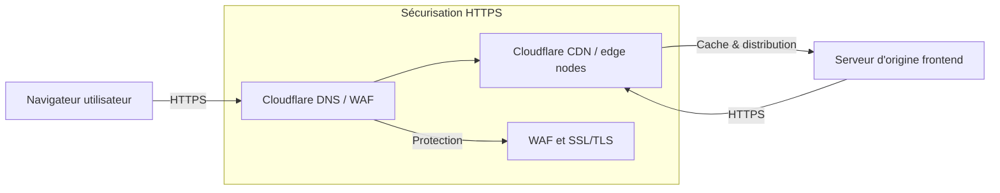

# Figure 4.1 : Déploiement du Frontend sur Cloudflare

## Objectif

Ce document contient le prompt et les éléments nécessaires pour générer une image technique avec GPT représentant l'architecture de déploiement du frontend sur Cloudflare.

## Légende

**Caption** : Architecture de déploiement du frontend sur l’infrastructure Cloudflare avec distribution CDN et sécurisation HTTPS.

## Nom de fichier recommandé

`figure-4-1-deploiement-frontend-cloudflare.png`

## Prompt GPT

```text
Génère une image technique professionnelle en français, style schéma d'architecture de déploiement, avec fond clair, palette sobre blanc/gris clair et accents orange/bleu foncé.

Titre du schéma : "Figure 4.1 : Déploiement du Frontend sur Cloudflare"

Objectif : Illustrer l'architecture de déploiement du frontend de l'application EPI Detection sur l'infrastructure Cloudflare, en mettant en évidence la distribution CDN, la sécurisation HTTPS, le DNS et la logique de cache.

Le schéma doit être lisible, propre, moderne et adapté à un mémoire ou à une documentation technique.

Composants à représenter sous forme de blocs ou de zones distinctes :
1. Navigateur utilisateur / client
2. Cloudflare DNS / WAF
3. Cloudflare CDN / edge nodes
4. Serveur d'origine du frontend statique (hébergement du site)
5. Sécurisation HTTPS / TLS
6. Cache CDN et distribution de contenu
7. Gestion SSL et protection des accès
8. Flots réseau entrants et sortants entre le client, Cloudflare et l'origine

Flux à faire apparaître :
- Le client accède au frontend via HTTPS.
- Le DNS Cloudflare résout le nom de domaine et dirige vers le réseau Cloudflare.
- Le WAF Cloudflare protège l'application et filtre le trafic.
- Le CDN Cloudflare distribue les ressources statiques du frontend.
- Le CDN met en cache les actifs et récupère le contenu depuis l'origine si nécessaire.
- Le trafic est sécurisé avec HTTPS de bout en bout.

Contraintes graphiques :
- style technique, institutionnel et professionnel
- pas de rendu cartoon
- texte en français uniquement
- flèches visibles et hiérarchie claire
- fond clair et blocages nets
- rendu compatible page web et document PDF

Ajouter une légende discrète en bas :
"Architecture de déploiement du frontend sur l’infrastructure Cloudflare avec distribution CDN et sécurisation HTTPS."
```

## Optionnel : diagramme Mermaid de base

Ce diagramme est une version textuelle simple du schéma et peut aider à visualiser la structure avant génération d'image.



## Utilisation

Copier ce prompt dans GPT pour générer l'image, puis enregistrer le fichier dans le dossier de documentation ou `frontend/public` selon le besoin.
