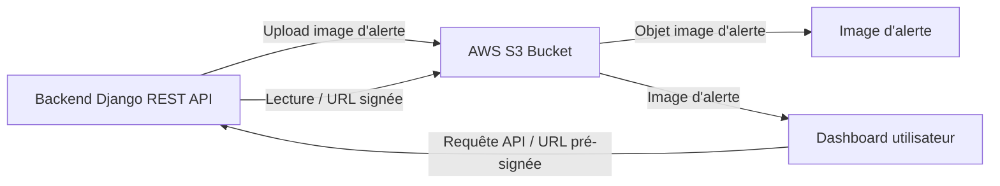

# Figure    : ²ed é 

## Objectif

Ce document contient le prompt et les éléments nécessaires pour générer une image technique avec GPT représentant l'architecture de stockage des images d'alertes sur AWS S3.

## Légende

**Caption** : Architecture de stockage et de récupération des images d’alertes avec AWS S3.

## Nom de fichier recommandé

`figure-architecture-stockage-aws-s3.png`

## Prompt GPT

```text
Génère une image technique professionnelle en français, style schéma d'architecture de stockage, avec fond clair, palette sobre blanc/gris clair et accents bleu/orange.

Titre du schéma : "Figure : Architecture de stockage AWS S3"

Objectif : Illustrer le flux de stockage et de récupération des images d'alertes du backend vers AWS S3, puis leur consultation depuis le dashboard.

Le schéma doit être lisible, propre, moderne et adapté à un mémoire ou à une documentation technique.

Composants à représenter sous forme de blocs ou de zones distinctes :
1. Backend Django REST API
2. AWS S3 Bucket
3. Objet image d'alerte
4. Dashboard / interface utilisateur
5. Flux d'upload depuis le backend vers S3
6. Flux de lecture depuis S3 vers le dashboard
7. Méta-données d'alerte / lien URL signé
8. Sécurisation d'accès et permissions S3

Flux à faire apparaître :
- Le backend stocke les images d'alertes dans AWS S3.
- Les images sont enregistrées comme objets dans un bucket S3.
- Les métadonnées d'alerte sont liées à ces objets.
- Le dashboard récupère les images via l'API ou des URLs pré-signées.
- Le backend peut générer des liens sécurisés pour l'accès aux images.
- Le dashboard affiche les images d'alerte et les détails associés.

Contraintes graphiques :
- style technique, institutionnel et professionnel
- pas de rendu cartoon
- texte en français uniquement
- flèches visibles et sens du flux clair
- fond clair et blocages nets
- rendu compatible page web et document PDF

Ajouter une légende discrète en bas :
"Architecture de stockage et de récupération des images d’alertes avec AWS S3."
```

## Optionnel : diagramme Mermaid de base

Ce diagramme est une version textuelle simple du schéma et peut aider à visualiser la structure avant génération d'image.



## Utilisation

Copier ce prompt dans GPT pour générer l'image, puis enregistrer le fichier dans le dossier de documentation ou `frontend/public` selon le besoin.
